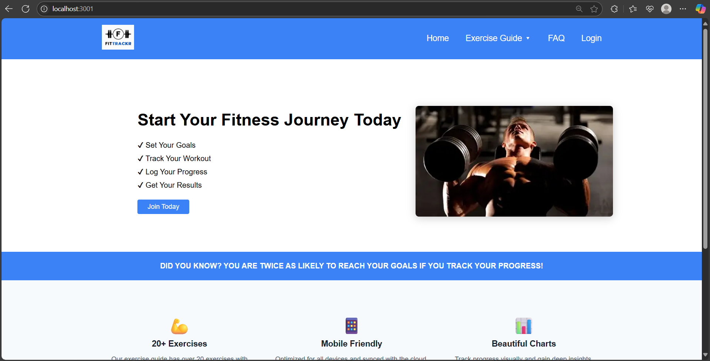
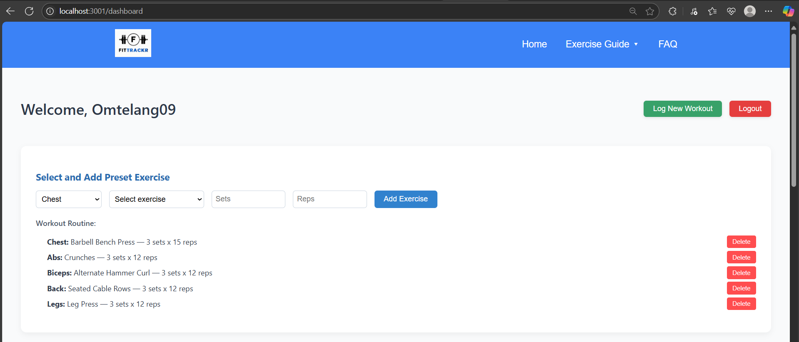
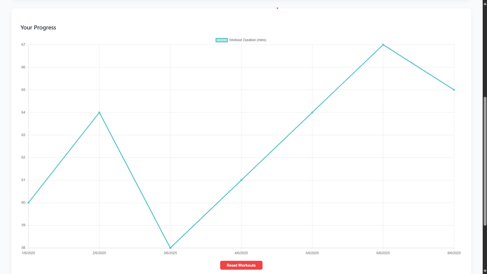
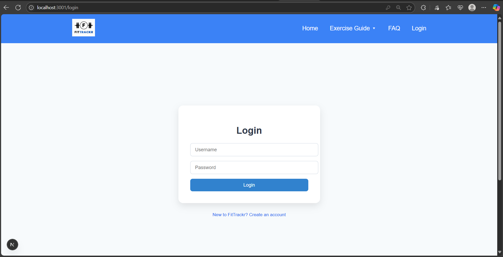
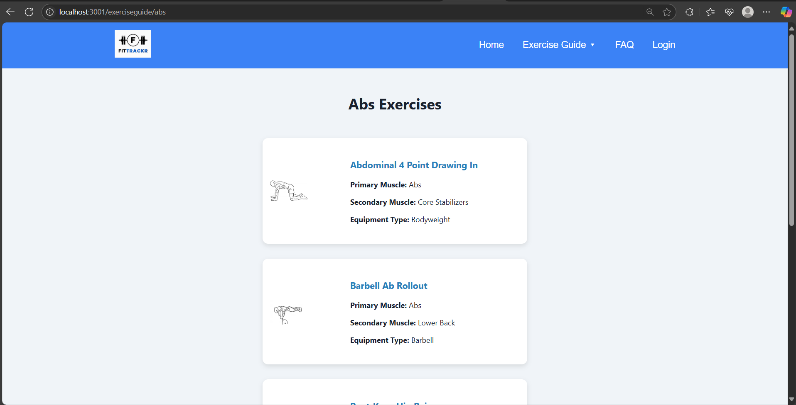
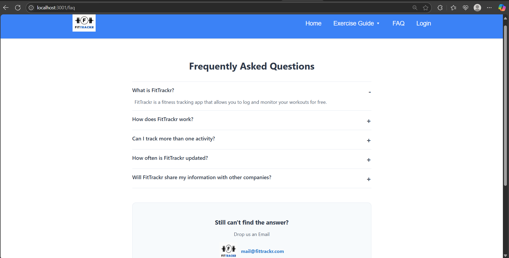

# 🏋️‍♂️ FitTrackr

**FitTrackr** is a full-stack fitness tracking web application built with **Next.js**, **React**, **Node.js**, **Express**, and **MongoDB**. It helps users track their workouts, monitor progress via interactive charts, and manage personalized exercise routines.

---

## 🔥 Features

- ✅ User registration and login system
- 🧠 Dashboard showing progress and saved exercises
- 📈 Workout logging and data visualization with Chart.js
- 💪 Exercise guides by muscle groups (Chest, Abs, Legs, Biceps, Back)
- 🔄 Preset and custom exercise management
- 🧹 Reset all workout data functionality
- 🧠 Persistent data storage with MongoDB
- 💻 Clean and modular UI with custom CSS modules

---

## 🛠️ Tech Stack

| Frontend        | Backend        | Database  |
|----------------|----------------|-----------|
| Next.js (React) | Express.js     | MongoDB   |
| HTML, CSS, JS   | Node.js        | Mongoose  |
| Chart.js        | RESTful APIs   |           |

---

## 📸 Screenshots

<details>
  <summary>Home Page</summary>
  
</details>
<details>
  <summary>Dashboard</summary>
  
  
</details>
<details>
  <summary>Login Page</summary>
  
</details>

<details>
  <summary>Exercise Guide</summary>
  
</details>
<details>
  <summary>FAQ</summary>
  
</details>

---

## 🚀 Getting Started

### 1. Clone the Repository

```bash
git clone https://github.com/your-username/fittrackr.git
cd fittrackr
```

### 2. Install Dependencies

#### Frontend (Next.js)

```bash
cd frontend
npm install
```

#### Backend (Express)

```bash
cd backend
npm install
```

### 3. Setup Environment Variables

#### Create `.env` file in `backend/`:

```env
MONGO_URI=your_mongodb_connection_string
PORT=5000
```

---

## 🔄 Run the App

### Start Backend

```bash
cd backend
npm run dev
```

### Start Frontend

```bash
cd frontend
npm run dev
```

Visit: [http://localhost:3000](http://localhost:3000)

---

## ✍️ Folder Structure

```
fittrackr/
├── backend/
│   ├── models/
│   ├── routes/
│   ├── controllers/
│   └── server.js
├── frontend/
│   ├── pages/
│   ├── styles/
│   ├── components/
│   └── public/
```

---

## 🙌 Contributing

Contributions are welcome! Feel free to fork this repo and submit a pull request.

---

## 💡 Author

Made with ❤️ by [Om Telang](https://github.com/your-username)
